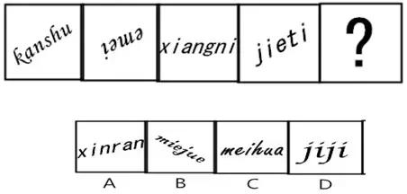
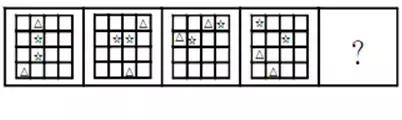
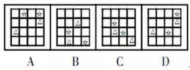

#数字找规律

## 负幂次数列

1、4、3、1、1/5、1/36、？

思路：1上升 再降回1，考虑 1 ^ x, 2 ^ x-1, ..., x ^ 0, x+1 ^ -1, ...

1 = 1^3，4 = 2^2，3 = 3^1，1 = 4^0，1/5 = 5^(-1)，1/36 = 6^(-2)

## 分子分母双数列，整数小数双数列

1/16、 2/13、 2/5、 8/7、？

思路：几乎都是分数，分子递增，考虑进行约分，分子与分母是否单独构成数列

1/16, 2/13, 2/5 = 4/10, 8/7, 4 = 16/4, 32/1 = 32

1.01、1.02、2.03、3.05、5.08、？

整数和小数分别构成数列fbnc

1，3/4，9/5，7/16，25/9，？

分子分母交替进行构成奇数列和平方数列

## 间隔数列或分组数列

33、32、34、31、35、30、36、29、？

思路：数列比较长，大小比较相近。此处为递增递减交错进行

## 取尾数列

6、7、3、0、3、3、6、9、5、？

思路：题干和选项都是个位数，且大小变动不稳定

## 与数位有关的数列

448、516、639、347、178、？

思路：都是几十、几百或者几千的整数，且大小变动不稳定

此处三位数的前两个数字相加等于最后个位上数字

## 幂次数列

底数和指数各自成规律，然后再加减修正系数

0、9、26、65、124、？

思路：6？=4^3、12？=11^2、14？=12^2、21？=6^3、25？=4^4、34？=7^3、51？=8^3、312？=5^5

0→9=2×2×2+1 ，9→26=3×3×3-1 ，26→65=4×4×4+1 ，65→124=5×5×5-1 ，124→217=6×6×6+1

## 递推数列

118、60、32、20、？

思路：类逼近式递减，考虑除法递推数列

118、60=118/2+1、32=60/2+2、20=32/2+4、

3、7、16、107、？

思路：题干和选项都是整数，且数字大小波动很大，考虑乘法或乘方递推

*2-5递推

## 含小数的复杂数列

2、13、40、61、（ ）A.46.75 B.82 C. 88.25 D.121

思路：考虑倍率变化，6->3->1.5->0.75 故选A

## 符号变换数列

2、7、14、21、294、？

思路：明显的乘法和加法：2*7=14，14+7=21

## 其他复杂形式

### 两次处理

0，1，3，8，22，63，？

第一次：1, 2, 5, 14, 41

第二次：1, 3, 9, 27 得到等比

很多数列都可以通过两次作差进行处理

## 图形数列

图形各部分代表的数量进行算术运算

# 图形找规律

## 变化

字母化的图形变化规律：点的数量多少

## 共性

### 1. 

所有三角形都分布在表格的边界上，所有的星星都在对角线上

